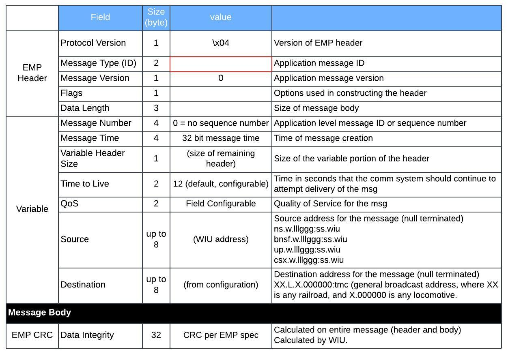

## Table of contents
{: .no_toc .text-delta }

1. TOC
{:toc}

---

### Overview
Interoperable Train Control Messaging (ITCM) is a messaging system used by the railroad industry. The Centralized train control (CTC)
messages are transported over ITCM. A railroad edge messaging protocol (EMP) header and a railroad Class D messaging transport header are appended to the message to generate a packet. The packet is transmitted to a receiving one of the railroad dispatch system and the railroad wayside system across the railroad communications system.

### Basic Message Packet Structure
ITCM is appeneded as part of EMP message body. Refer to [Class D](../) for additional details

### Message Type (ID)

Wayside Interface Unit (WIU) 
Reference: AAR S‐9202 - Interoperable Train Control Wayside Interface Unit Requirements Railway Electronics 

| Message Type           | hex   | decimal |
|:-----------------------|:------|:--------|
| WIUStatus Timed Beacon | 13 EC | 5100    |
| GetWIUStatus Response  | 13 ED | 5101    |
| GetWIUStatus           | 14 51 | 5201    |
| BeaconOn               | 14 50 | 5200    |
| Time                   | 14 B4 | 5300    |

