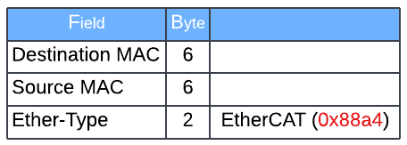
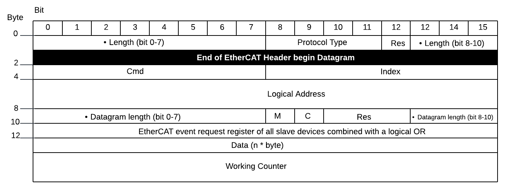

# EtherCAT
{: .no_toc }

## Table of contents
{: .no_toc .text-delta }

1. TOC
{:toc}

---

### Overview
EtherCAT (Ethernet for Control Automation Technology) is an Ethernet-based fieldbus system developed by Beckhoff Automation.

### Basic Structure

The EtherCAT telegram starts with an Ethernet header, followed by the EtherCAT data. The telegram is terminated by a frame check sequence (FCS). The EtherCAT data start with an EtherCAT header, followed by EtherCAT datagrams. If the entire Ethernet frame is smaller than 64 bytes, between 1 and 32 padding bytes are inserted at the end of the EtherCAT data. The EtherCAT data can contain up to 15 datagrams. A datagram consists of a header, the data to be read or written and a working counter.

EtherCAT ethernet frame header<br>


EtherCAT telegram


- Cmd - EtherCAT command type
- Index - The index is a numerical identifier used by the master to identify duplicates or lost datagrams
- Address - Address: auto-increment, configured station address or logical address
- C - 0: Frame does not circulate, 1: Frame has circulated once
- M - 0: Last EtherCAT datagram, 1: At least one further EtherCAT datagram follows
- Res - reserved (0)

Both EtherCAT frame header and datagram length are in little-endian. eg.
```
EtherCAT frame header
    .... .000 0111 0110 = Length: 0x076
    .... 0... .... .... = Reserved: Valid (0x0)
    0001 .... .... .... = Type: EtherCAT command (0x1)

Hex: dump
0000   76 10 
```
```
Length     : 8 (0x8) - No Roundtrip - More Follows...
    .... .000 0000 1000 = Length: 8
    ..00 0... .... .... = Reserved: Valid (0)
    .0.. .... .... .... = Round trip: Frame is not circulating
    1... .... .... .... = Last indicator: More EtherCAT datagrams will follow

Hex dump:
0000   08 80 
```

### CoE
CoE (CANopen over EtherCAT) is a communication protocol stack and device profile specification for embedded systems used in automation. EDS files are used to describe functions and properties of any not configured CANopen device and application profiles.<br>
Wireshark filter
```
ecat_mailbox.type == 3
```
```
EtherCAT Mailbox Protocol:CoE SDO Req : 'Initiate Upload' (2) Idx=0x2106 Sub=0
    Header
        Length: 10
        Address: 0x0001
        .... ..00 = Priority: 0
        Type: CoE (CANopen over EtherCAT) (3)
        Counter: 0
    CoE
        Number: 0
        Type: SDO Req (2)
        SDO Req : 'Initiate Upload' (2) Idx=0x2106 Sub=0
            Init Upload: 0x40
                ...0 .... = Access: Legacy
        Index: 0x2106
        SubIndex: 0x00
```

In Can over EtherCAT (CoE), an index and subindex are used to identify and access parameters of an EtherCAT device. The below example shows the index for device identification.


For vendor specific object dictionary, refer to device specification file or manual such as ESI, EDS, XDD file.

### Reference
[Comprehensive guide to the EtherCAT protocol](https://www.embien.com/industrial-insights/comprehensive-guide-to-the-ethercat-protocol)<br>
[https://www.beckhoff.com/de-de/support/downloadfinder/suchergebnis/?c-1=27833244](https://www.beckhoff.com/de-de/support/downloadfinder/suchergebnis/?c-1=27833244)<br>
[Omron - EtherCAT Communication Manual](https://edata.omron.com.au/eData/Vision/Q179-E1-01.pdf)<br>
[https://infosys.beckhoff.com/english.php?content=../content/1033/ax86x0_object/7809564171.html&id=](https://infosys.beckhoff.com/english.php?content=../content/1033/ax86x0_object/7809564171.html&id=)<br>
[Kollmorgen - How to capture and use EtherCAT trace data with WireShark](https://www.kollmorgen.com/sites/default/files/How%20to%20capture%20and%20use%20WireShark%20trace%20data%20with%20EtherCAT%20applications.pdf)