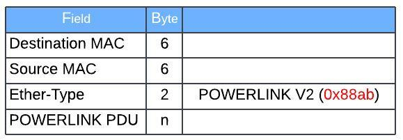
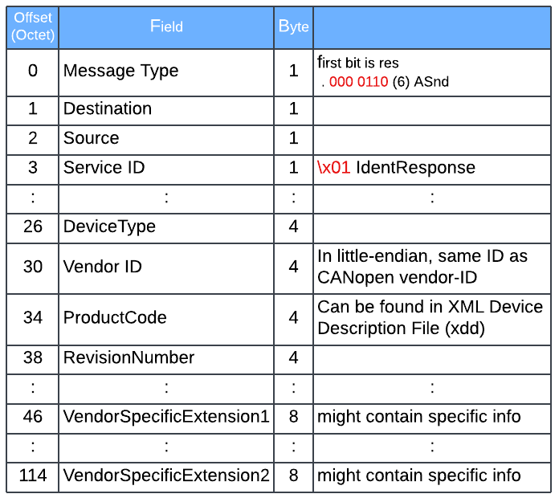

# POWERLINK
{: .no_toc }

## Table of contents
{: .no_toc .text-delta }

1. TOC
{:toc}

---

### Overview
Ethernet POWERLINK is a real-time protocol that allows devices from different manufacturers to communicate with each other over standard Ethernet. The open protocol is now managed by the Ethernet POWERLINK Standardization Group (EPSG). It was introduced by Austrian automation company B&R.
 
### Basic Structure
This section focuses on frame strucutre relavent to device identification. For additional info for other purposes, refer to "POWERLINK Communication Profile Specification" from [Technical documents](https://www.br-automation.com/en/technologies/powerlink/service-downloads/technical-documents/) site.

POWERLINK Ethernet frame


PDU for Asynchronous Send - IdentityResponse


### Wireshark Filter & Sample Pcap
IdentResponse
```
epl.asnd.svid == 0x01
```
IdentRequest
```
epl.soa.svid == 1
```
C_DLL_MULTICAST_ASND - POWERLINK ASnd multicast MAC address
```
eth.dst == 01:11:1e:00:00:04
```

Sample 1
```
Ethernet POWERLINK
    .000 0110 = MessageType: Asynchronous Send (ASnd) (6)
    Destination: 255 (0xff) (broadcast)
    Source: 5 (0x05) (Controlled Node)
    Requested Service ID: IdentResponse (0x01)
    ...0 .... = EN (Exception New): False
    .... 0... = EC (Exception Clear): False
    0... .... = FLS (First Link Status): False
    .0.. .... = SLS (Second Link Status): False
    ..00 0... = PR (Priority): lowest (0)
    .... .000 = RS (RequestToSend): 0
    NMTStatus: NMT_CS_PRE_OPERATIONAL_1 (0x1d)
    EPLVersion: 2.0
    FeatureFlags: 0x00058267
    MTU: 300
    PollInSize: 36
    PollOutSize: 76
    ResponseTime: 2000
    DeviceType: 0x0000 (No Standard Device)
    DeviceType additional info: 0
    VendorId: 16777324 (0x0100006c)
    ProductCode: 43886 (0x0000ab6e)
    RevisionNumber: 0 (0x00000000)
    SerialNumber: 169428 (0x000295d4)
    VendorSpecificExtension1: 12593 (0x0000000000003131)
    VerifyConfigurationDate: 0 (0x00000000)
    VerifyConfigurationTime: 976461222 (0x3a339da6)
    ApplicationSwDate: 0 (0x00000000)
    ApplicationSwTime: 0 (0x00000000)
    IPAddress: 192.168.100.5
    SubnetMask: 255.255.255.0
    DefaultGateway: 192.168.100.254
    HostName: 5-100006c
    VendorSpecificExtension2: 44021cb04e113830564431303050532e433030582d3031ffffffffffffffffffffffffffffffffffffffffffffffffff


0000   06 ff 05 01 00 00 1d 00 20 00 67 82 05 00 2c 01   ........ .g...,.
0010   24 00 4c 00 d0 07 00 00 00 00 00 00 00 00 6c 00   $.L...........l.
0020   00 01 6e ab 00 00 00 00 00 00 d4 95 02 00 31 31   ..n...........11
0030   00 00 00 00 00 00 00 00 00 00 a6 9d 33 3a 00 00   ............3:..
0040   00 00 00 00 00 00 05 64 a8 c0 00 ff ff ff fe 64   .......d.......d
0050   a8 c0 35 2d 31 30 30 30 30 36 63 00 00 00 00 00   ..5-100006c.....
0060   00 00 00 00 00 00 00 00 00 00 00 00 00 00 00 00   ................
0070   00 00 44 02 1c b0 4e 11 38 30 56 44 31 30 30 50   ..D...N.80VD100P
0080   53 2e 43 30 30 58 2d 30 31 ff ff ff ff ff ff ff   S.C00X-01.......
0090   ff ff ff ff ff ff ff ff ff ff ff ff ff ff ff ff   ................
00a0   ff ff                                             ..
```

### Reference
[https://www.br-automation.com/downloads_br_productcatalogue/assets/EPSG_301_V-1-5-1_DS-c710608e.pdf](https://www.br-automation.com/downloads_br_productcatalogue/assets/EPSG_301_V-1-5-1_DS-c710608e.pdf)<br>
[https://reference.opcfoundation.org/POWERLINK/v100/docs/4.1](https://reference.opcfoundation.org/POWERLINK/v100/docs/4.1)<br>
[https://www.bronkhorst.com/int/products/accessories-and-software/flowware/powerlink-xdd/](https://www.bronkhorst.com/int/products/accessories-and-software/flowware/powerlink-xdd/)<br>
[https://github.com/epl-viz/resources/blob/master/pcaps/2017-03-17_br_robot_normal.pcapng.gz](https://github.com/epl-viz/resources/blob/master/pcaps/2017-03-17_br_robot_normal.pcapng.gz)<br>
[https://github.com/wireshark/wireshark/blob/master/epan/dissectors/packet-epl.c](https://github.com/wireshark/wireshark/blob/master/epan/dissectors/packet-epl.c)