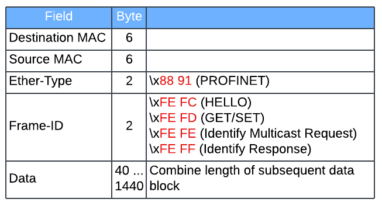
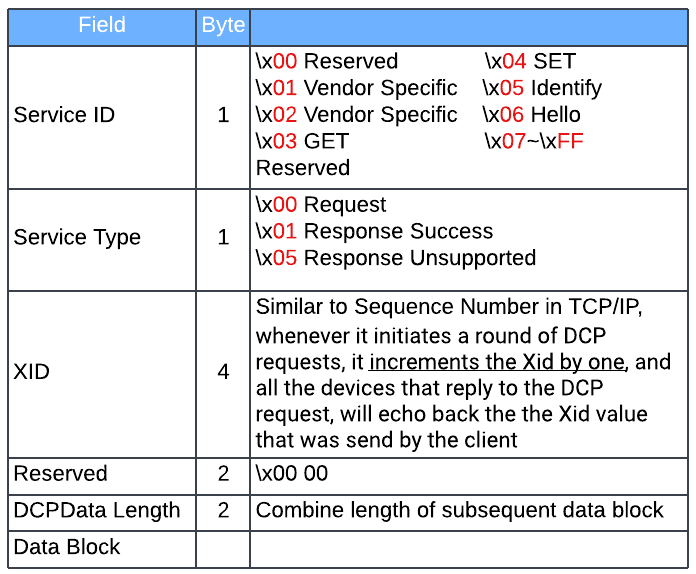
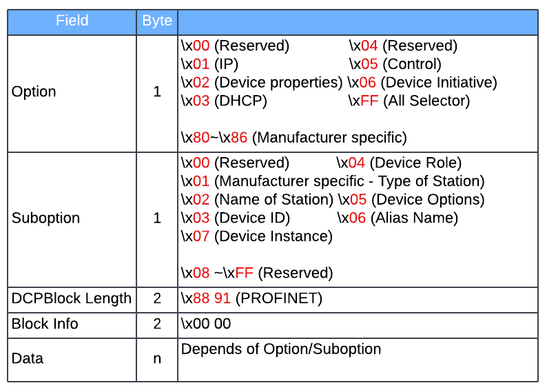

# PROFINET DCP (Discovery and Configuration Protocol)
{: .no_toc }

## Table of contents
{: .no_toc .text-delta }

1. TOC
{:toc}

---

### Overview
The Discovery and Configuration Protocol (DCP) for Profinet is a link layer protocol that's part of the Profinet protocol suite. It's used to configure device settings, identify device information, and discover devices on a Profinet network

### Basic Structure
PROFINET Real-Time Ethernet frame



PROFINET DCP PDU



PDU Data Block


### Device Identification
VendorID can be used to identify manufacturer, list of vendor ID can be found at [Man_ID_Table.xml](https://www.profibus.com/IM/Man_ID_Table.xml)<br>
For Siemens device, the DeviceID has the format (DeviceClass/DeviceFamily)
```
# Sample Wireshark Dissector Info, 002a is vendor ID for Siemens AG
Block: Device/Device ID, BlockInfo: Reserved, VendorID: 0x002a / DeviceID: 0x0301
    Option: Device properties (2)
    Suboption: Device ID (3)
    DCPBlockLength: 6
    BlockInfo: Reserved (0)
    VendorID: 0x002a
    DeviceID: 0x0301
```

Device Role signifing the type of device (e.g. 'IO-Controller')
```
Block: Device/Device Role, BlockInfo: Reserved, IO-Device
    Option: Device properties (2)
    Suboption: Device Role (4)
    DCPBlockLength: 4
    BlockInfo: Reserved (0)
    DeviceRoleDetails: 0x01
    Reserved: 0
```

For manufacturer specifc device ID, find the device relavent GSD file from PI's [product finder](https://www.profibus.com/products/product-finder#c84). The XML file should contains the value for identifying specfic product<br>
Below sample is part of the GSD file for Siemens' SINAMICS G120D
```
<ProfileBody>
		<DeviceIdentity VendorID="0x002A" DeviceID="0x0507">
			<InfoText TextId="IDT_FamilyDescription"/>
			<VendorName Value="Siemens AG"/>
```


### Reference
[https://github.com/boundary/wireshark/blob/master/plugins/profinet/packet-pn.h](https://github.com/boundary/wireshark/blob/master/plugins/profinet/packet-pn.h)<br>
[https://github.com/boundary/wireshark/blob/master/plugins/profinet/packet-pn.c](https://github.com/boundary/wireshark/blob/master/plugins/profinet/packet-pn.c)<br>
[https://github.com/boundary/wireshark/blob/master/plugins/profinet/packet-pn-dcp.c](https://github.com/boundary/wireshark/blob/master/plugins/profinet/packet-pn-dcp.c)<br>
[https://us.profinet.com/profinet-network-geeks-want/](https://us.profinet.com/profinet-network-geeks-want/)
