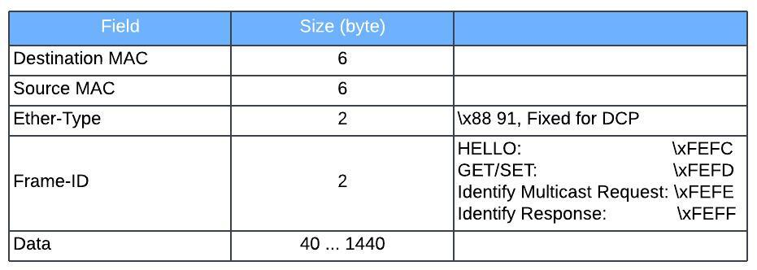

# PROFINET DCP (Discovery and Configuration Protocol)
{: .no_toc }

## Table of contents
{: .no_toc .text-delta }

1. TOC
{:toc}

---

### Overview
The Discovery and Configuration Protocol (DCP) for Profinet is a link layer protocol that's part of the Profinet protocol suite. It's used to configure device settings, identify device information, and discover devices on a Profinet network

### Basic Structure
PROFINET Real-Time Ethernet frame

### Sig

--ethertype profinet