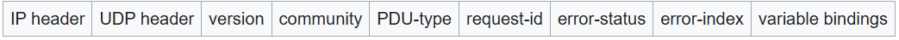
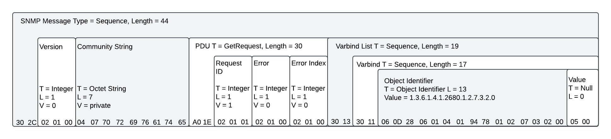

# SNMP
{: .no_toc }

## Table of contents
{: .no_toc .text-delta }

1. TOC
{:toc}

---

### Overview
Simple Network Management Protocol (SNMP) is an Internet Standard protocol for collecting and organizing information about managed devices on IP networks and for modifying that information to change device behavior. 

SNMP exposes management data in the form of variables on the managed systems organized in a management information base <b>(MIB)</b>, which describes the system status and configuration. These variables can then be remotely queried/manipulated by managing applications. 

An SNMP message is a packet sent over UDP/IP to port 161. UDP/IP is the User Datagram Protocol over IP. an SNMP message must be a valid <b>ASN.1</b> data type, and encoded according to the <b>BER</b>.

### Structure
References: [https://www.ranecommercial.com/legacy/note161.html](https://www.ranecommercial.com/legacy/note161.html)

### PDU Types
| PDU Type         | Value (hex) |
|:-----------------|:------------|
| get-request      | 00          |
| get-next-request | 01          |
| get-response     | 02          |
| set-request      | 03          |
| trap             | 04          |
| getBulkRequest   | 05          |
| informRequest    | 06          |
| snmpV2-trap      | 07          |
| report           | 08          |