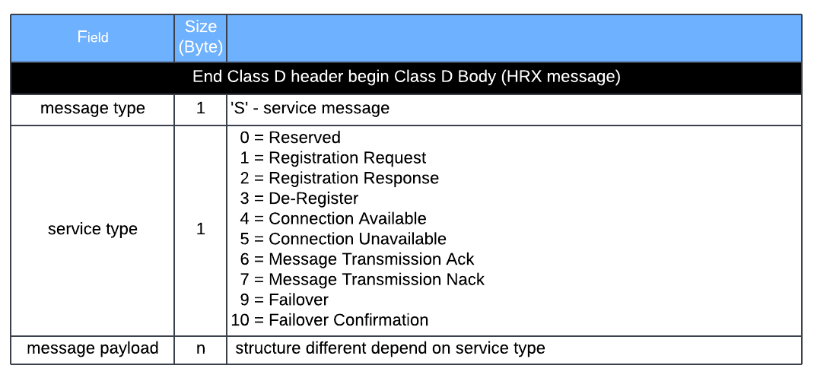

## Table of contents
{: .no_toc .text-delta }

1. TOC
{:toc}

---

### Overview
Radio to ELM or CM interface between a radio and an ELM or a CM primarily supports the passing of data messages to and from the radio. It also supports service messages to control the flow of information across the interface. This interface is defined by the Host/Radio eXchange (HRX) Protocol. HRX is an application level protocol which is transported over Class D and TCP/IP

### Basic Message Packet Structure
HRX service message


HRX data message from ELM or CM


HRX data message from Radio to ELM or CM


### Wireshark Filter & Sample Hex dump
HRX message type: data message ('D')
```
(tcp.srcport == 9000 || tcp.dstport == 9000) && tcp.payload[0:2] == 02:02 && tcp.payload[12:1] == 0x44
```

### Reference
[US10469586](https://patentimages.storage.googleapis.com/d6/eb/a6/d28d4825c5e017/US10469586.pdf)<br>
[ITCRSystemSpecification](https://railroads.dot.gov/sites/fra.dot.gov/files/fra_net/2808/ITCRSystemSpecification.pdf)