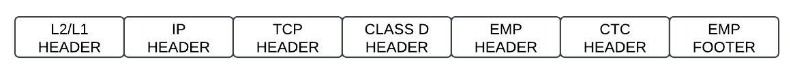
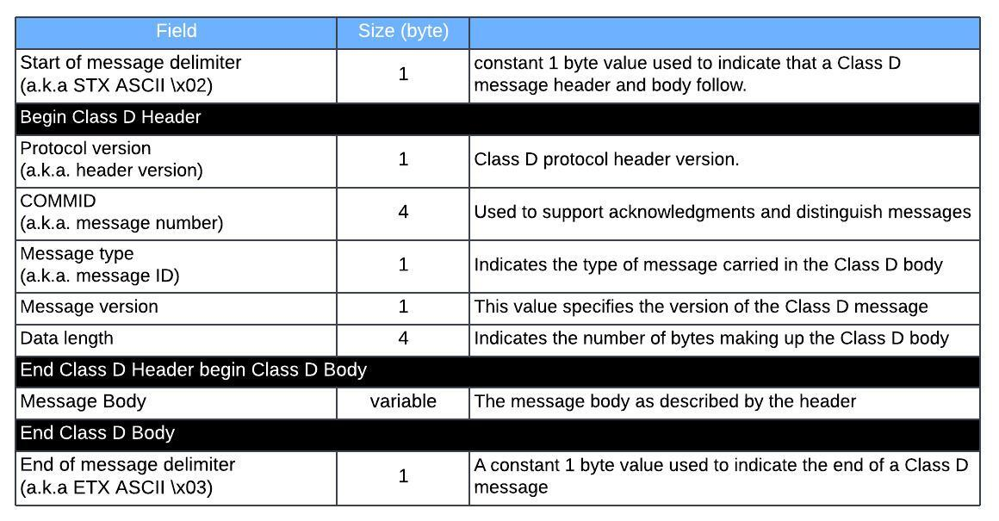
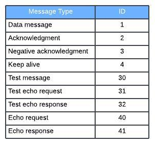
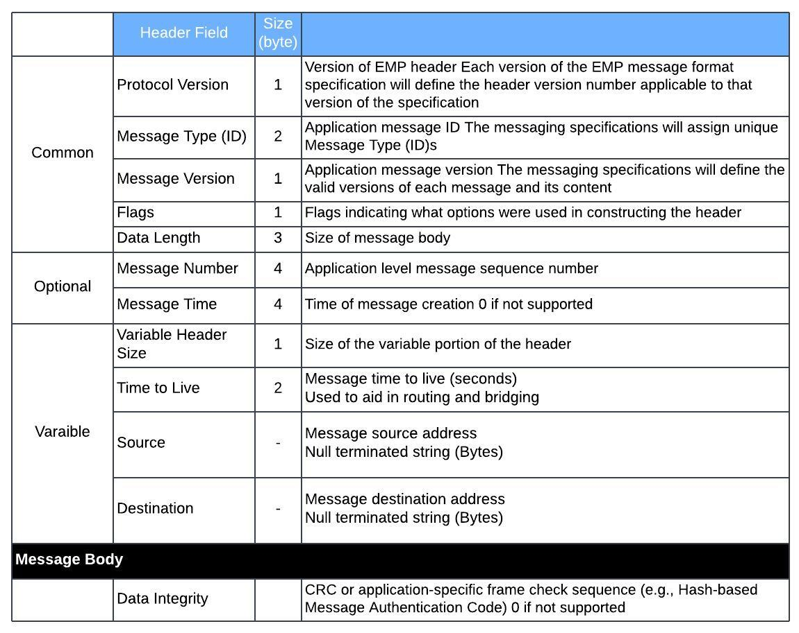

# Class D
{: .no_toc }

## Table of contents
{: .no_toc .text-delta }

1. TOC
{:toc}

---

### Overview
Class D is a protocol that converts a stream based TCP protocol to a message or transaction based protocol. The Class D protocol is intended for applications requiring reliable point-to-point message delivery.

### Basic Message Packet Structure



### Class D Packet Structure





### EMP (Edge Messaging Protoco) General Packet Structure
An AAR published application level protocol.



### Sample Hex Dump
```
0000   02 02 00 00 1d 01 01 02 00 00 00 50 04 13 ec 00   ...........P....
0010   09 00 00 10 00 00 00 00 66 a3 b9 ee 2b 00 10 06   ........f...+...
0020   38 63 73 78 74 2e 77 2e 37 33 39 31 30 30 3a 31   8csxt.w.739100:1
0030   31 2e 77 69 75 00 78 78 2e 6c 2e 78 2e 30 30 30   1.wiu.xx.l.x.000
0040   30 30 30 3a 74 6d 63 00 a5 e8 b6 fb fb 82 0e 8a   000:tmc.........
0050   f7 bd ef 2a 0f 2d f0 3d 82 d6 df 53 03            ...*.-.=...S.

Class D Transport Laywer
    STX: (\x02)
    Protocol Version: (\x02)
    COMMID: (\x00001D01) 7425
    Message Type: Data Message (\x01)
    Message Version: (\x02) 2
    Data Length: (\x00000050) 80
EMP
    Protocol Version: (\x04) 4
    Message Type: (\x13EC) 5100
    Message Version: (\x00) 0
    Flags: (\x09)
    Data Length: (\x000010) 16
    Message Number: (\x00000000)
    Message Time: (\x66A3B9EE)
    Remaining Header Size: (\x2B) 43
    Time to Live: (\x0010) 16 sec
    Source: ..csxt.w.739100:11.wiu
    Destination: xx.l.x.000000:tmc
    Data Integrity: (\xA5E8B6FBFB820E8AF7BDEF2A0F2DF03D82D6DF53)
ITCM
    ETX: (\x03)
```

wireshark filter for EMP message type (sub XX to message id in hex)
```
tcp.payload[0:2] == 02:02 && tcp.payload[6:1] == 01 &&  tcp.payload[13:2] == XX:XX
```

### EMP Message Body - Application
[Interoperable Train Control Messaging](./itcm/)

### Resource links
[ROSA P](https://rosap.ntl.bts.gov/)<br>
[FRA eLibrary](https://railroads.dot.gov/elibrary-search)<br>

### Reference
- AAR Manual of Standards and Recommended Practices Railway Electronics - CLASS D MESSAGING SPECIFICATION Standard S-9356
- Federal Railroad Administration - Railroad Wireless Communications Roadmap
- AAR Manual of Standards and Recommended Practices Railway Electronics - Edge Message Protocol SPecification Standard S-9354