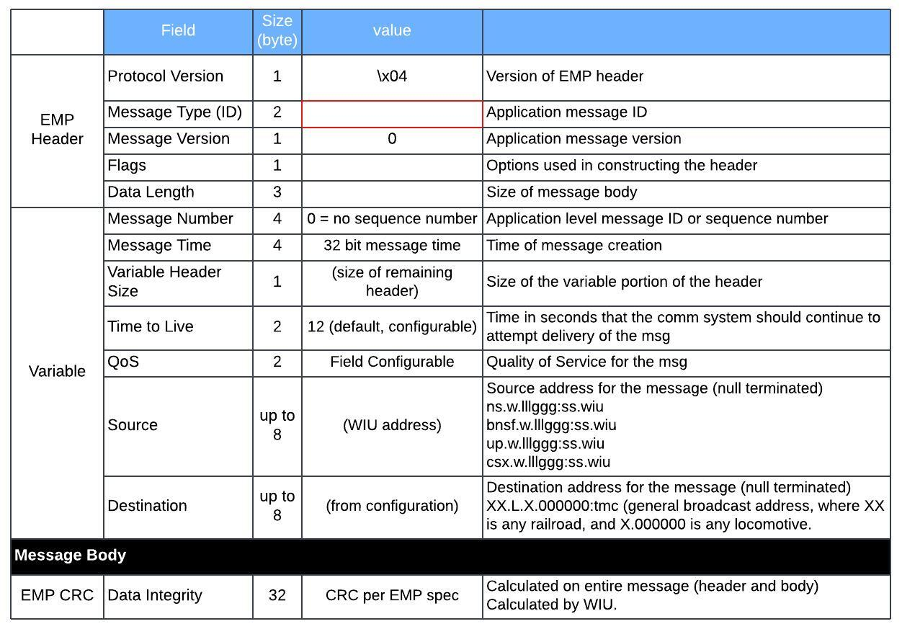

## Table of contents
{: .no_toc .text-delta }

1. TOC
{:toc}

---

### Overview
Interoperable Train Control Messaging (ITCM) is a messaging system used by the railroad industry. The Centralized train control (CTC)
messages are transported over ITCM. A railroad edge messaging protocol (EMP) header and a railroad Class D messaging transport header are appended to the message to generate a packet. The packet is transmitted to a receiving one of the railroad dispatch system and the railroad wayside system across the railroad communications system.

### Basic Message Packet Structure
ITCM is appeneded as part of EMP message body. Refer to [Class D](../) for additional details

### PTC Message Type (EMP Message Type)

Wayside Interface Unit (WIU) 
Reference: AAR S‐9202 - Interoperable Train Control Wayside Interface Unit Requirements Railway Electronics 

| Message Type           | hex   | decimal |
|:-----------------------|:------|:--------|
| WIUStatus Timed Beacon | 13 EC | 5100    |
| GetWIUStatus Response  | 13 ED | 5101    |
| GetWIUStatus           | 14 51 | 5201    |
| BeaconOn               | 14 50 | 5200    |
| Time                   | 14 B4 | 5300    |

Wayside Device Controller (WDC) 
Reference: US-10160466B1, US-2019126961 

| Message Type                  | hex   | decimal |
|:------------------------------|:------|:--------|
| WDC Status                    | 1B D0 | 7120    |
| WDC Status Ack                | 1B D1 | 7121    |
| WDC Status Nack               | 1B D2 | 7122    |
| Get WDC Status                | 1B D3 | 7123    |
| WDC Control                   | 1B D4 | 7124    |
| WDC Control Ack               | 1B D5 | 7125    |
| WDC Control Nack              | 1B D6 | 7126    |
| WDC Reset Sequence Number     | 1B D7 | 7127    |
| WDC Reset Sequence Number Ack | 1B D8 | 7128    |

Automated Train Operation (ATO) 
Reference: Automated Train Operation Interface Requirements Specification Development Summary Report 

| Message Type                                             | hex   | decimal |
|:---------------------------------------------------------|:------|:--------|
| ITC-ATO Ex to ITC-ATOSS BO Poll                          | 00 64 | 100     |
| ITC-ATOSS BO to ITC-ATO Ex Poll ACK                      | 00 65 | 101     |
| ITC-ATOSS BO Poll Registration                           | 00 66 | 102     |
| ITC-ATO Ex/ITC-ATO SP Configuration Version List Request | 00 67 | 103     |
| ITC-ATO Ex System State Report                           | 00 6E | 110     |
| Exception Report                                         | 00 6F | 111     |
| Information Request ACK                                  | 00 72 | 114     |
| Information Retrieval                                    | 00 73 | 115     |
| Condition Resolution ACK                                 | 00 74 | 116     |

