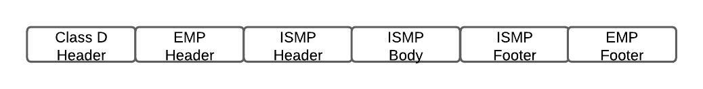
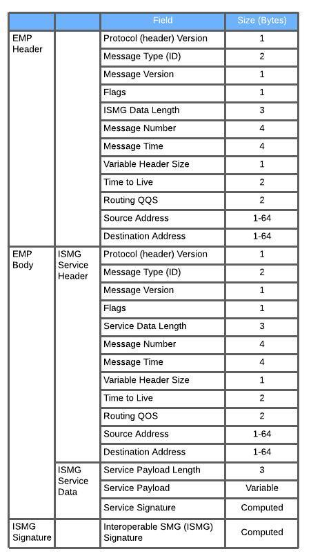

## Table of contents
{: .no_toc .text-delta }

1. TOC
{:toc}

---

### Overview
ISMP (Interoperable Systems Management Protocol) 

For ITCSM and PTC applications, ITCM system embeds an ISMP application message within an Edge Message Protocol (EMP) message envelope. The EMP message envelope is then embedded into a Class D transport packet for TCP/IP - based presentation to Communications Segment.

### Basic Message Packet Structure

Reference: Monitoring and Analysis of the Integrated Network (MAIN): Phase II Final Report - Federal Railroad Administration

### Message Type (ID)

* The Message Type (ID) field of the Service Header shall be the same value as the Message Version (ID) field of the ISMG Header

MAIN-CDX Data Transfer Messages 
Reference: Monitoring and Analysis of the Integrated Network (MAIN): Phase II Final Report - Federal Railroad Administration

| Message Type           | hex   | decimal |
|:-----------------------|:------|:--------|
| Data Transfer Request  | 28 3F | 10303   |
| Data Transfer Response | 28 40 | 10304   |
| Notification           | 28 41 | 10305   |
| Notification Response  | 28 42 | 10306   |