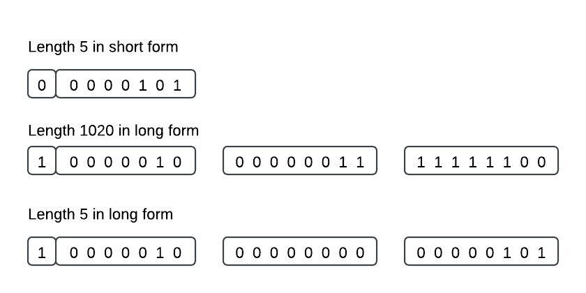

## Table of contents
{: .no_toc .text-delta }

1. TOC
{:toc}

---

## Basic Encoding Rules Overview

BER uses a Tag-Length-Value (TLV) format for encoding information. The type or tag indicates what kind of data follows, the length indicates the length of the data that follows, and the value represents the actual data. Each value may consist of one or more TLV-encoded values, each with its own identifier, length, and contents.

<table>
    <tbody>
        <tr>
            <th>T (Tag)</th>
            <th>L (Len)</th>
            <th>V (Value)</th>
        </tr>
    </tbody>
</table>

## Encoding Identifiers 

### Tags

The identifier consists of three parts:

<table>
    <tbody>
        <tr>
            <th>Class (2 bit)</th>
            <th>Form (1 bit)</th>
            <th>Number (5 bit)</th>
        </tr>
    </tbody>
</table>

<b>Class<b>

- [ 00 ] universal class. Most BER elements have a universal type, so any element with a universal type specifies what kind of data it holds. Examples of universal types include 0x01 (BOOLEAN), 0x02 (INTEGER), 0x04 (OCTET STRING), 0x05 (NULL), 0x0A (ENUMERATED), 0x30 (SEQUENCE), and 0x31 (SET). The binary encodings for all of those type values have the leftmost two bits set to zero.

- [ 01 ] The application-specific class. This class allows an application to define its own types that are consistent throughout that application. In this context, LDAP is considered an application. For example, when 0x42 appears in LDAP, it indicates an unbind request protocol op, because RFC 2251 section 4.3 states that the unbind request protocol op has a type of [APPLICATION 2].

- [ 10 ] The context-specific class. This class indicates that the type is specific to a particular usage within a given application. The same type can be re-used in different contexts in the same application as long as there is enough other information to determine which context is applicable in a given situation. For example, in the context of the credentials in a bind request protocol op, the context-specific type 0x80 is used to hold the bind password, but in the context of an extended operation it would be used to hold the request OID.

- [ 11 ] The private class, not typically used in LDAP.

<b>Form<b>

- [ 0 ] primitive - is used with types that do not contain other types (INTEGERs and BOOLEANs). The contents octets directly represent the encoded value.
- [ 1 ] constructed - is used for types that can include values of other types (SEQUENCEs).

<b>Number<b>

- 0 <= tag <= 30, the last five bits of the identifier octet as an unsigned binary integer.
- 31 < =tag <= 127, the last five bits of this first octet are all set to 1, and the actual value of the tag's number is encoded in one or more following octets. The final octet of this series has bit 7 set to 0.
- tag > 127, The other octets set bit 7 to 1. The actual value of the tag's number is encoded as an unsigned binary integer, as the concatenation of the rightmost seven bits of each octet.

### Length

There are three ways to encode lengths in BER:
- Short form - for lengths between 0 and 127, the one-octet short form can be used. bit 7 of the length octet is set to 0, and the length is encoded as an unsigned binary value in the octet's rightmost seven bits.
- Long form - for lengths between 0 and 2^1008 octets, it starts with an octet that contains the length of the length, followed by the actual length of the encoded value.
- Indefinite form - used only with constructed encodings. when the length of the value being encoded is not known at the beginning. A single ooctet is placed between the identifier and the contents that contain the fixed value hexadecimal 80. The end of the encoded value is indicated by two special end-of-contents octets, each containing all 0's.

## References
[https://www.oss.com/asn1/resources/asn1-made-simple/asn1-quick-reference/asn1-tags.html](https://www.oss.com/asn1/resources/asn1-made-simple/asn1-quick-reference/asn1-tags.html) 
[https://www.oss.com/asn1/resources/asn1-made-simple/asn1-quick-reference/basic-encoding-rules.html](https://www.oss.com/asn1/resources/asn1-made-simple/asn1-quick-reference/basic-encoding-rules.html) 