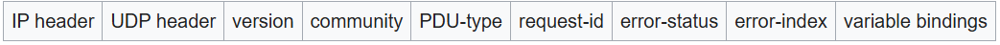
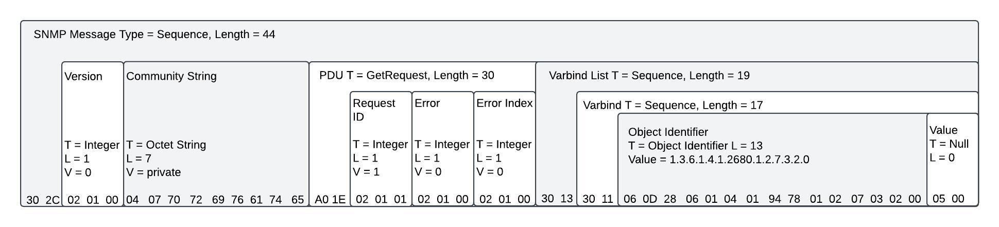

# SNMP
{: .no_toc }

## Table of contents
{: .no_toc .text-delta }

1. TOC
{:toc}

---

### Overview
Simple Network Management Protocol (SNMP) is an Internet Standard protocol for collecting and organizing information about managed devices on IP networks and for modifying that information to change device behavior.<br>

SNMP exposes management data in the form of variables on the managed systems organized in a management information base <b>(MIB)</b>, which describes the system status and configuration. These variables can then be remotely queried/manipulated by managing applications.<br>

An SNMP message is a packet sent over UDP/IP to port 161. UDP/IP is the User Datagram Protocol over IP. an SNMP message must be a valid <b>ASN.1</b> data type, and encoded according to the <b>BER</b>.

### Structure
References: [https://www.ranecommercial.com/legacy/note161.html](https://www.ranecommercial.com/legacy/note161.html)




```
0000   30 39 02 01 01 04 06 70 75 62 6c 69 63 a2 2c 02   09.....public.,.
0010   04 5a 29 c6 d4 02 01 00 02 01 00 30 1e 30 1c 06   .Z)........0.0..
0020   08 2b 06 01 02 01 01 01 00 04 10 52 75 67 67 65   .+.........Rugge
0030   64 43 6f 6d 20 52 58 31 35 30 31                  dCom RX1501
```

According to BER, the first two numbers of any OID ( x.y ) are encoded as one value using the formula (40*x)+y. The first two numbers in an SNMP OID are always 1.3. Therefore, the first two numbers of an SNMP OID are encoded as 43 or 0x2B, because (40*1)+3 = 43.

### Common Data Types
Refer to [BER Encoding](./ber-encoding/) for more details

| Primitive Type | Identifier | Complex Data Types | Identifier |
|:---------------|:-----------|:-------------------|:-----------|
| Integer        | 0x02       | get-request        | 0xA0       |
| Octet String   | 0x04       | get-next-request   | 0xA1       |
| Null           | 0x05       | get-response       | 0xA2       |
| OID            | 0x06       | set-request        | 0xA3       |
|                |            | trap               | 0x04       |
|                |            | getBulkRequest     | 0x05       |
|                |            | informRequest      | 0x06       |
|                |            | snmpV2-trap        | 0x07       |
|                |            | report             | 0x08       |

### Common MIB & OID for device identification

MIBs describe the structure of the management data of a device subsystem; they use a hierarchical namespace containing object identifiers (OID). Each OID identifies a variable that can be read or set via SNMP. Two of the commonly seen node are "1.3.6.1.2.1" and "1.3.6.1.4.1". The first one is used in MIB-II, while the later one is "enterprise" specific node.<br>

The number immediately followed "1.3.6.1.4.1" is called PEN (Private Enterprise Numbers). For instance, "1.3.6.1.4.1.9" is used to identify the organization "Cisco", and the child OIDs are used to primarily for managing Cisco devices. All assigned PENs can be found on the [Internet Assigned Numbers Authority (IANA)](https://www.iana.org/assignments/enterprise-numbers/?q=cisco) web site.<br>

Tables below are examples of MIB file and OID commonly used for device identification.

| MIB        | OID                     | Value                     | Description                       |
|:-----------|:------------------------|:--------------------------|:----------------------------------|
| MIB-II     | sysDescr                | 1.3.6.1.2.1.1.1           | textual description of the entity |
|            | sysObjectID             | 1.3.6.1.2.1.1.2           | vendor's authoritative identification of thenetwork management subsystem contained in the entity |
| ENTITY-MIB | entPhysicalSoftwareRev  | 1.3.6.1.2.1.47.1.1.1.1.10 | vendor specifc software revision  |
|            | entPhysicalModelName    | 1.3.6.1.2.1.47.1.1.1.1.13 | vendor specific model name        |
|            | entPhysicalDescr        | 1.3.6.1.2.1.47.1.1.1.1.2  | textual description of the entity |
|            | entPhysicalName         | 1.3.6.1.2.1.47.1.1.1.1.7  | textual name of entity            |
|            | entPhysicalHardwareRev  | 1.3.6.1.2.1.47.1.1.1.1.8  | vendor specific hardware revision |
|            | entPhysicalFirmwareRev  | 1.3.6.1.2.1.47.1.1.1.1.9  | vendor specific firmware revision |

| MIB                      | OID                        | Value                          | Description                       |
|:-------------------------|:---------------------------|:-------------------------------|:----------------------------------|
| PRINTER-PORT-MONITOR-MIB | ppmPrinterIEEE1284DeviceId | 1.3.6.1.4.1.2699.1.2.1.2.1.1.3 | IEEE 1284 Device id               |

| MIB     | OID                          | Value                | Description                   |
|:--------|:-----------------------------|:---------------------|:------------------------------|
| UPS-MIB | upsIdentManufacturer         | 1.3.6.1.2.1.33.1.1.1 | UPS manufacturer              |
|         | upsIdentModel                | 1.3.6.1.2.1.33.1.1.2 | UPS model                     |
|         | upsIdentUPSSoftwareVersion   | 1.3.6.1.2.1.33.1.1.3 | UPS firmware/software version |
|         | upsIdentAgentSoftwareVersion | 1.3.6.1.2.1.33.1.1.4 | UPS agent software version    |