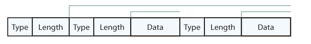

# SNMP MIB Browsing Reference

* [Browsing tool](#browisng-tool)
* [MIB file resources](#mib-file-resrouces)
* [SNMP packet structure](#snmp-packet-structure)
* [Detection logic for SNMP response](#detection-logic-for-snmp-response)

## Browisng tool
* [ireasoning MIB browser](https://www.ireasoning.com/mibbrowser.shtml)
* [Kali snmpcheck](https://www.kali.org/tools/snmpcheck/)

***
## MIB file resrouces
* [http://www.mibdepot.com/index.shtml](http://www.mibdepot.com/index.shtml)
* [https://www.circitor.fr/Mibs/Mibs.php](https://www.circitor.fr/Mibs)
* [https://mibs.observium.org/](https://mibs.observium.org/)
* [http://oid-info.com](http://oid-info.com)
* [http://www.snmplink.org/cgi-bin/nd/m/Ent/](http://www.snmplink.org/cgi-bin/nd/m/Ent/)

<b>oid-info.com</b> and <b>mib.observium.org</b> are good for checking which company registered specific oid. </br>Both <b>mibdepot</b> and <b>circitor</b> works better when you already knowns the OID, buts lacks information about the child node.

***
## SNMP packet structure
* [RFC](#rfc)
* [Encoding Rules](#encoding-rules)
* [detection logic for SNMP response](#detection-logic-fro-snmp-response)

### RFC
\* from https://www.rfc-editor.org/rfc/rfc1592<br>
Assuming that no errors occurred, the port is returned in the last
few octets of the received packet.  In the simple case, where the
port number will be between 1024 and 16,385, the format of the packet
is shown below.

Note: In practice, the port number can be any positive number in the
range from 1 through 65,535.  A port number of 0 means that the agent
does not have a dpiPort defined for the requested protocol.  So the
actual port value maybe in the last 1, 2 or 3 octets.  The sample
implementation code shows how to handle the response to cover all
those cases, including error conditions.

Note: The (SNMPv1) packet shown below is for the TCP port.
```
+-----------------------------------------------------------------+
| Table 2 (Page 1 of 3). SNMP RESPONSE PDU for dpiPortForTCP.0    |
+---------------+----------------+--------------------------------+
| OFFSET        | VALUE          | FIELD                          |
+---------------+----------------+--------------------------------+
| 0             | 0x30           | ASN.1 header                   |
+---------------+----------------+--------------------------------+
| 1             | 39 + len       | length, see formula below      |
+---------------+----------------+--------------------------------+
| 5             | 0x04           | community name (string)        |
+---------------+----------------+--------------------------------+
| 6             | len            | length of community name       |
+---------------+----------------+--------------------------------+
| 7             | community name |                                |
+---------------+----------------+--------------------------------+
| 7 + len       | 0xa2 0x1e      | SNMP RESPONSE:                 |
|               |                | request_type=0xa2,length=0x1e  |
+---------------+----------------+--------------------------------+
| 7 + len + 2   | 0x02 0x01 0x01 | SNMP request ID:               |
|               |                | integer,length=1,ID=1          |
+---------------+----------------+--------------------------------+
| 7 + len + 5   | 0x02 0x01 0x00 | SNMP error status:             |
|               |                | integer,length=1,error=0       |
+---------------+----------------+--------------------------------+
| 7 + len + 8   | 0x02 0x01 0x00 | SNMP index:                    |
|               |                | integer,length=1,index=0       |
+---------------+----------------+--------------------------------+
| 7 + len + 11  | 0x30 0x13      | varBind list, length=0x13      |
+---------------+----------------+--------------------------------+
| 7 + len + 13  | 0x30 0x11      | varBind, length=0x11           |
+---------------+----------------+--------------------------------+
| 7 + len + 15  | 0x06 0x0b      | Object ID, length=0x0b         |
+---------------+----------------+--------------------------------+
| 7 + len + 17  | 0x2b 0x06 0x01 | Object-ID:                     |
|               | 0x04 0x01 0x02 | 1.3.6.1.4.1.2.2.1.1.1          |
|               | 0x02 0x01 0x01 | Object-instance: 0             |
|               | 0x01 0x00      |                                |
+---------------+----------------+--------------------------------+
| 7 + len + 28  | 0x02 0x02      | integer, length=2              |
+---------------+----------------+--------------------------------+
| 7 + len + 30  | MSB LSB        | port number (MSB, LSB)         |
+---------------+----------------+--------------------------------+
```

### Encoding Rules
Some data types, like Sequences and PDUs, are built from several smaller fields. Therefore, a complex data type is encoded as nested fields</br>

```
+----------------------+------------+--------------------+------------+
| Primitive Data Types | Identifier | Complex Data Types | Identifier |
+----------------------+------------+--------------------+------------+
| Integer              | 0x02       | Sequence           | 0x30       |
+----------------------+------------+--------------------+------------+
| Octet String         | 0x04       | GetRequest PDU     | 0xA0       |
+----------------------+------------+--------------------+------------+
| Null                 | 0x05       | GetResponse PDU    | 0xA2       |
+----------------------+------------+--------------------+------------+
| Object Identifier    | 0x06       | SetRequest PDU     | 0xA3       |
+----------------------+------------+--------------------+------------+
```


## Detection logic for SNMP response
```
* match UDP traffic
* match ASN.1 header, \x30
* match SNMPv1/v2 version field \x02 \x01 \x00 or \x02 \x01 \x01
* match Octet string type for community string \x04
* match get response PDU type \xA2
* match SNMP OID, for instance 1.3.6.1.2.1.1.1, sysDescr for MIBv2
```
